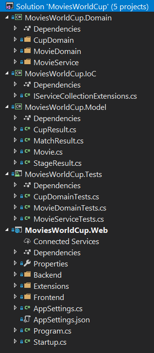
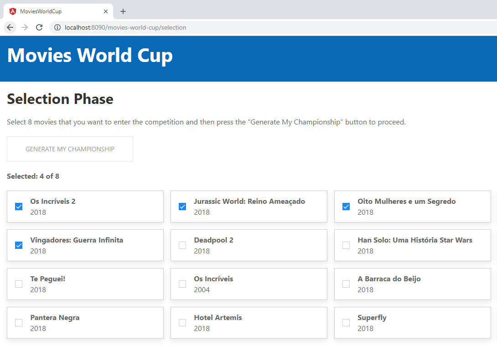
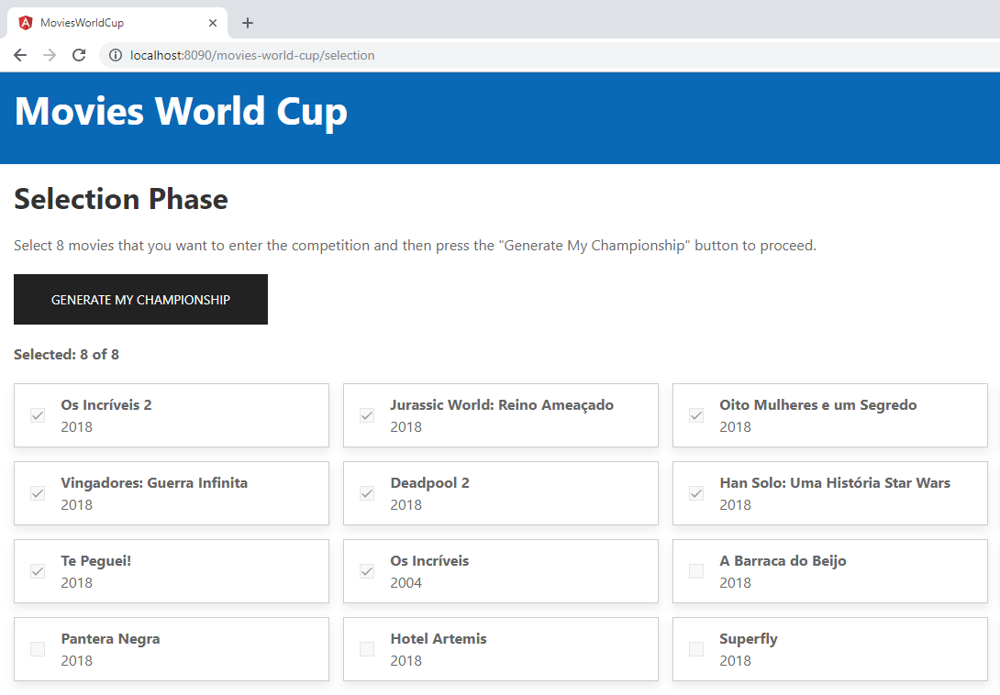
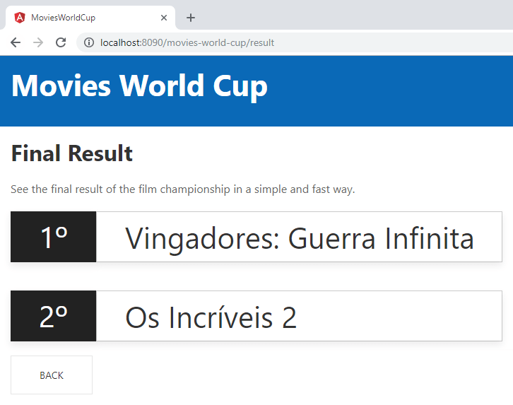

# MoviesWorldCup

## Tools, Practices and Technologies

* Cross-Platform (Windows, Linux, macOS)
* Docker
* Visual Studio 2017
* Visual Studio Code
* .NET Core 2.1.5
* ASP.NET Core 2.1.5
* C# 7.3
* SPA (Single Page Application)
* Angular 7.0.2
* Typescript 3.1.6
* HTML5
* CSS3
* SASS (Syntactically Awesome Style Sheets)
* UIkit
* DDD (Domain-Driven Design)
* SOLID Principles
* Dependency Injection
* Unit Test
* Response Caching
* Code Analysis (Ruleset for C# and TSLint for Typescript)

## Screenshots

## Run Command Line

1. Install [.NET Core SDK](https://aka.ms/dotnet-download).

2. Open directory **source\Web\Frontend** in command line and execute **npm run restore**.

3. Open directory **source\Web** in command line and execute **dotnet run**.

4. Open <https://localhost:8095>.

## Run Visual Studio Code

1. Install [.NET Core SDK](https://aka.ms/dotnet-download).

2. Install [C# Extension](https://marketplace.visualstudio.com/items?itemName=ms-vscode.csharp).

3. Open directory **source\Web\Frontend** in command line and execute **npm run restore**.

4. Open **source** directory in Visual Studio Code.

5. Press **F5**.

## Run Docker

1. Install and configure [Docker](https://www.docker.com/get-started).

2. Execute **docker-compose up --build -d --force-recreate** in root directory.

3. Open <http://localhost:8080>.
